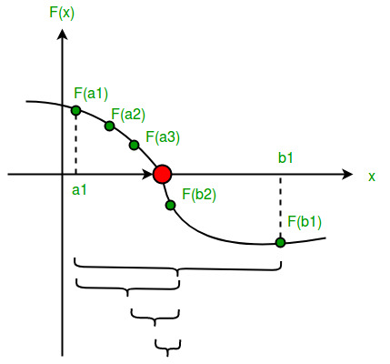

# Bisection Method

Bracketing method for finding real roots of nonlinear equations.

## Working Principle

The bisection method repeatedly divides a bracketing interval into two equal parts and selects the half that still contains the root. For a continuous function, if

$$
f(a)f(b)<0
$$

then at least one root lies between \(a\) and \(b\). The interval is then bisected to obtain a new approximation.

### Derivation of \(x_0\)

From the diagram, \(x_0\) is the midpoint of the initial interval \([a,b]\). Therefore, the distance from \(a\) to \(x_0\) is equal to the distance from \(x_0\) to \(b\):

$$
x_0-a=b-x_0
$$

Rearranging,

$$
x_0+x_0=a+b
$$

$$
2x_0=a+b
$$

Therefore,

$$
\boxed{x_0=\frac{a+b}{2}}
$$

The same calculation is repeated for each new bracketing interval. If the new interval is \([a,x_0]\), the next approximation is

$$
x_1=\frac{a+x_0}{2}
$$

and if the new interval is \([x_0,b]\),

$$
x_1=\frac{x_0+b}{2}
$$

Thus, each iteration reduces the interval width by half.

## Assumptions

* The function should be continuous over the selected interval.
* The initial interval should bracket a root:
  `f(a) * f(b) < 0`
* Endpoint roots should be handled separately.

## Use Cases

* Reliable real-root finding.
* Problems where derivatives are unavailable.
* Situations where guaranteed convergence is more important than speed.

## Convergence

* Guaranteed when the function is continuous and the initial interval brackets a root.
* Linear convergence.
* The interval width is approximately halved after every iteration.

## Complexity

* Time per iteration: **O(1)** assuming constant-time function evaluation.
* Number of iterations:
  **O(log₂((b-a)/ε))**
* Overall: **O(log((b-a)/ε))**

## Limitations

* Requires a valid bracketing interval.
* Cannot find complex roots.
* Generally slower than faster open methods.
* A root without a sign change may not be detected by the basic bracketing condition.

## Variations

* Adaptive bisection
* Hybrid bisection/Newton methods
* Hybrid bisection/secant methods

## Reference

* [GeeksforGeeks: Bisection Method](https://www.geeksforgeeks.org/dsa/program-for-bisection-method/?utm_source=chatgpt.com)
